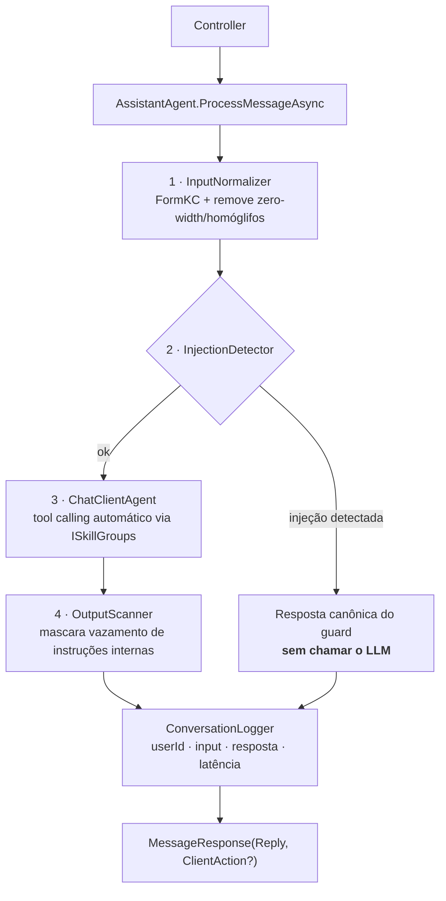

# AiAssistant — Template .NET 8 para Assistentes com MAF

Template reutilizável para construir assistentes de IA em .NET 8 sobre o **Microsoft Agent Framework (MAF)**, destilado de um projeto real. A arquitetura, as decisões de segurança e as escolhas de design são descritas no artigo [Chatbot com C# e Microsoft Agent Framework (MAF): as decisões que realmente importam](https://medium.com/@mrpaiva/chatbot-com-c-e-microsoft-agent-framework-maf-as-decis%C3%B5es-que-realmente-importam-b6c842a25b80).

---

## Arquitetura

O template é organizado em quatro camadas:

| Camada | Projeto | Responsabilidade |
|---|---|---|
| **Core** | `AiAssistant.Core` | Contratos (`IAssistantAgent`, `ISkillGroup`, middlewares), modelos (`ConversationTurn`, `ClientAction`) e interfaces de infra |
| **Infra** | `AiAssistant.Infra` | Implementações de infra: `ConversationLogger`, `SessionValidator` e middlewares de segurança (`InputNormalizer`, `InjectionDetector`, `OutputScanner`) |
| **AI** | `AiAssistant.AI` | `AssistantAgent`: loop MAF, middleware de segurança, sessão por usuário, purga e `SampleSkillsGroup` |
| **API** | `AiAssistant.API` | Controller REST, DI (`AddAiAssistant`), configuração e UI de chat embutida |

### Fluxo de uma requisição



As barreiras 1–4 rodam como **middleware dentro do pipeline do MAF** (`AIAgentBuilder.Use`): a detecção de injeção **curto-circuita antes do LLM**, e o turno é auditado mesmo quando bloqueado.

---

## As decisões que importam

**(1) Skills como grupos componíveis (`ISkillGroup`)**
Cada conjunto de tools é encapsulado em uma classe que implementa `ISkillGroup`. O `AssistantAgent` recebe `IEnumerable<ISkillGroup>` e compõe as tools automaticamente. Novas skills entram sem tocar no agente.

**(2) Segurança como middleware do MAF — 3 barreiras**
As barreiras não são filtros externos ao agente: elas rodam *dentro* do pipeline do MAF, antes e depois do LLM. Isso garante que o bloqueio por guard seja rastreável na auditoria e não confundível com recusa do modelo.

**(3) Sessão por usuário com purga**
O `AssistantAgent` mantém um `ConcurrentDictionary<string, SessionEntry>`. Sessões inativas por mais de 4 h são removidas pela purga periódica. O timeout é injetável para facilitar testes.

**(4) `IChatClient` OpenAI-compat — troca de provedor por configuração**
O agente depende apenas de `IChatClient` (`Microsoft.Extensions.AI`). Para trocar de provedor basta mudar `Assistant:LlmEndpoint` e `Assistant:LlmModel` em `appsettings.json` (ou user-secrets). Sem recompilação.

Essas decisões estão documentadas como ADRs no projeto do Linear.

---

## Quickstart

### Pré-requisitos

- [.NET 8 SDK](https://dotnet.microsoft.com/download/dotnet/8)

### 1. Configurar a chave da API

**Nunca commite segredos.** O `appsettings.json` real **não é versionado** (está no `.gitignore`); o repositório traz apenas `appsettings.example.json` como modelo. Copie o exemplo e preencha a chave:

```bash
cp src/AiAssistant.API/appsettings.example.json src/AiAssistant.API/appsettings.json
# edite appsettings.json e preencha "Assistant:LlmApiKey"
```

O exemplo já vem apontando para o OpenRouter (`Assistant:LlmEndpoint` / `Assistant:LlmModel`); troque por qualquer provedor compatível com a API OpenAI (OpenAI, DeepSeek, Groq, Ollama, etc.). Veja a seção **Usando o OpenRouter** abaixo.

Alternativa (sem editar arquivo), via user-secrets:

```bash
dotnet user-secrets set "Assistant:LlmApiKey" "<sua-chave>" --project src/AiAssistant.API
```

> O app falha na inicialização se `LlmApiKey` estiver vazio — por design, para evitar erros silenciosos em produção.

#### Usando o OpenRouter

O [OpenRouter](https://openrouter.ai) é um gateway compatível com a API OpenAI — prático e barato. Como o provedor é apenas configuração, funciona sem tocar no código:

```json
"Assistant": {
  "LlmEndpoint": "https://openrouter.ai/api/v1",
  "LlmModel": "openai/gpt-4o-mini"
}
```

```bash
dotnet user-secrets set "Assistant:LlmApiKey" "sk-or-v1-..." --project src/AiAssistant.API
```

**A arquitetura inteira depende do modelo chamar tools** (é assim que as skills funcionam — a `SampleSkillsGroup`, e as suas no futuro):

- **Chat + pipeline de segurança:** funciona com qualquer modelo.
- **Skills (tools):** exige um modelo com suporte a *function calling*. No OpenRouter, escolha um com tools — bons e baratos: `openai/gpt-4o-mini`, `google/gemini-2.0-flash-001`, `deepseek/deepseek-chat`. **Evite** os `:free` (geralmente sem tools e com rate limit agressivo).

Dois detalhes que derrubam quem é novo no OpenRouter:

1. **O `LlmModel` é namespaced** (`openai/gpt-4o-mini`, não `gpt-4o-mini`). Se apontar pro OpenRouter e deixar o default `gpt-4o-mini`, dá erro de modelo inexistente.
2. Os headers `HTTP-Referer`/`X-Title` do OpenRouter são **opcionais** (só ranking/atribuição) — não precisa, o template funciona sem.

### 2. Rodar

```bash
dotnet run --project src/AiAssistant.API
```

Abra o navegador na URL exibida no terminal para acessar a UI de chat.

Para ver o **tool calling** em ação, experimente:

- `que horas são?` → o modelo chama a tool `get_current_time` e responde com a data/hora real.
- `mostra um toast dizendo oi` → o modelo chama `show_toast`, que volta um `ClientAction` para o front (a notificação 🔔).

Perguntar *"o que você sabe fazer?"* só **descreve** as capacidades — a tool é invocada quando a tarefa exige.

### 3. Testes

```bash
dotnet test
```

---

## Criando sua primeira skill

Uma skill é uma classe que implementa `ISkillGroup` e expõe uma ou mais `AIFunction`s. O `AssistantAgent` recebe `IEnumerable<ISkillGroup>`, junta as tools de todos os grupos e entrega ao modelo — que decide quando chamar cada uma a partir da **descrição** que você escreve.

**1. Implemente `ISkillGroup`** em um arquivo novo (ex.: `src/AiAssistant.AI/Skills/Calculadora/CalculadoraSkillsGroup.cs`):

```csharp
using System.ComponentModel;
using AiAssistant.AI.Skills;
using Microsoft.Extensions.AI;

public sealed class CalculadoraSkillsGroup : ISkillGroup
{
    public string GroupName => "CalculadoraSkills";

    public IReadOnlyList<AIFunction> BuildTools() =>
    [
        AIFunctionFactory.Create(
            Somar,
            "somar",
            "Soma dois números. Use quando o usuário pedir um cálculo de adição."),
    ];

    [Description("Retorna a soma de a e b")]
    private static double Somar(
        [Description("primeiro número")] double a,
        [Description("segundo número")] double b) => a + b;
}
```

> A **descrição** da tool e de cada parâmetro é o que o modelo lê para decidir quando e como chamá-la — capriche nelas.

**2. Registre no DI** (em `ServiceCollectionExtensions.AddAiAssistant`):

```csharp
services.AddSingleton<ISkillGroup, CalculadoraSkillsGroup>();
```

**3. Teste:** rode o app e peça *"quanto é 17 + 25?"* — o modelo vai chamar `somar` e responder `42`.

### Tools que agem no cliente (`ClientAction`)

Quando uma tool precisa disparar algo no front (navegar, abrir um modal, exibir um toast), ela registra um `ClientAction` que volta na resposta HTTP (`MessageResponse.Action`). Como o grupo precisa falar com o agente — que guarda o `ClientAction` pendente da sessão —, ele recebe no construtor um `Func<string?>` (userId corrente) e um `Action<string, ClientAction>` (callback), e o DI injeta o agente via `Lazy<>` para quebrar o ciclo agente↔skill. Use a `SampleSkillsGroup` (tool `show_toast`) e o seu registro em `ServiceCollectionExtensions` como referência.

> **Quando tiver as suas skills, delete a `SampleSkillsGroup`** (e o teste dela) — ela existe só para demonstrar o padrão.

---

## Blocos disponíveis

O `SessionValidator` (em `AiAssistant.Infra`) é um building block testado para validar que um usuário é dono de uma sessão. Registre-o e injete quando adicionar autenticação ao projeto.

---

## Renomear o template

Use `rename.ps1` para substituir o token `AiAssistant` pelo nome do seu projeto em todo o código-fonte, namespaces, arquivos e diretórios:

```powershell
# Dry-run — mostra o que seria feito, sem alterar nada:
./rename.ps1 -Name MeuBot

# Aplicar de verdade:
./rename.ps1 -Name MeuBot -Apply
```

Após o rename, abra a solução pelo novo arquivo `.slnx` gerado.

---

## Segurança

- O repositório versiona apenas `appsettings.example.json` (placeholders, sem valores reais); o `appsettings.json` real fica **fora do git**.
- Segredos vão via `appsettings.json` local, `dotnet user-secrets` (desenvolvimento) ou variáveis de ambiente / key vault (produção) — nunca commitados.
- O `.gitignore` já cobre `appsettings.json`, `appsettings.Development.json`, `secrets.json`, `*.db` e `Data/`.
